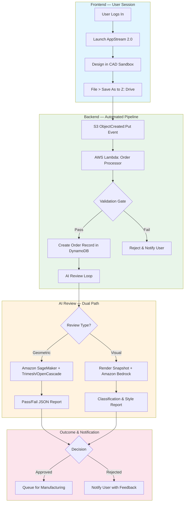
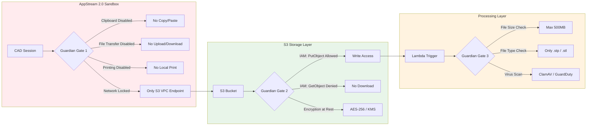
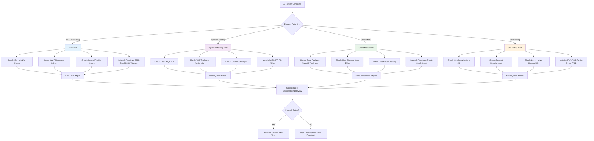
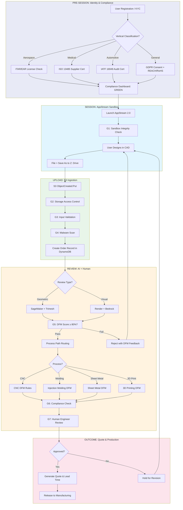

# Solutions Discovery: CAD Design-to-Order Pipeline

## Overview

This document outlines a secure, cloud-native **Design-to-Order** pipeline for CAD workflows, fully supported by **AWS AppStream 2.0**. The core architectural principle is treating the **"Save" button inside the CAD software as the "Order" button**, ensuring the user never touches the source file outside a controlled sandbox environment.

---

## 1. The User Experience (Frontend)

| Step | Action | Details |
|------|--------|---------|
| 1 | **Login** | The client logs into a branded web portal (hosted on AWS Amplify or EC2) and launches a session. |
| 2 | **The Sandbox** | AppStream 2.0 opens in their browser. They see a Windows desktop with only the authorized CAD software (e.g., SelfCAD Desktop, AutoCAD, Blender) installed. |
| 3 | **Design** | They create their 3D object using the cloud's GPU power. |
| 4 | **Submit Order** | When finished, they go to **File > Save As**. |
| 5 | **The "Magic" Drive** | Instead of saving to `C:\`, they select a special mapped drive (e.g., `Z:` Home Folder). This drive is actually an **Amazon S3 bucket** connected to the backend. |
| 6 | **Completion** | Once saved, the file instantly vanishes from their view (or moves to a "submitted" folder), and they receive a notification on the web portal that the design is under review. |

> **Key Insight:** The user experience is intentionally identical to a normal "Save" operation, but the backend intercepts and processes the file as an order submission.

---

## 2. The "Push" Mechanism (Backend)

No manual upload is required. The push is automated via storage integration.

### Step 1: AppStream Storage Connector

- Configure AppStream with a **Home Folder** backed by an **Amazon S3 bucket**.
- To the Windows OS, this appears as a local hard drive.
- To the backend, it is a cloud storage bucket under full administrative control.

**Constraint:** Set S3 bucket permissions so the user has `PutObject` (Write) access but deny `GetObject` (Download) for files outside their active session. This creates a **"Drop Box"** pattern.

### Step 2: The Trigger (S3 Event Notification)

Configure the S3 bucket to send an event notification whenever a new `.stp` or `.stl` file is saved.

- **Event:** `s3:ObjectCreated:Put`
- **Target:** AWS Lambda function

### Step 3: AWS Lambda "Order Processor"

When the Lambda function receives the signal that a new file exists:

1. **Validation:** Checks the file size and type.
2. **Database Entry:** Creates an "Order" record in the database (e.g., DynamoDB) linked to that specific client ID.
3. **AI Handoff:** Sends the file location to the AI Model for review.

---

## 3. The AI Review Loop

Since reviewing a 3D STP file is a complex geometric task, two main AI paths are available depending on the review objective:

### Option A: Geometric Analysis (Amazon SageMaker)

Use this path when checking for **manufacturability** (e.g., "Are walls too thin?", "Is there non-manifold geometry?").

- The Lambda triggers a Python script using libraries like **Trimesh** or **OpenCascade** to analyze the STP file geometry.
- **Output:** Returns a Pass/Fail JSON report.

### Option B: Visual/Aesthetic Review (Amazon Bedrock)

Use this path when checking for **visual style** or **categorization**.

- The Lambda triggers a rendering engine (like Blender running in a container) to take a 2D snapshot of the 3D model.
- The image is sent to **Amazon Bedrock** (Claude 3 or Titan) for visual analysis.
- **Output:** `"This design looks like a [Chair]. Style: [Modern]."`

---

## 4. Security Configuration (The "No Export" Rule)

To ensure the file never leaves the sandbox, apply these specific AppStream 2.0 policies:

| Feature | Setting | Purpose |
|---------|---------|---------|
| **Clipboard** | Clipboard Redirection: **Disabled** | Prevents Copy/Paste of text or files to local PC. |
| **File Transfer** | File Transfer: **Disabled** | Removes the "Upload/Download" button from the AppStream toolbar. |
| **Printers** | Print to Local Device: **Disabled** | Prevents printing to local devices. |
| **Network** | Security Groups | Block internet access from the AppStream fleet, allowing traffic only to the S3 bucket VPC endpoint. Prevents users from opening a browser inside the remote session and emailing the file to themselves. |

---

## Summary of Workflow

```
User Saves to Z: Drive
        ↓
File lands in S3 Bucket
        ↓
S3 Triggers Lambda
        ↓
Lambda calls AI Model
        ↓
AI validates STP file
        ↓
Lambda emails Client: "Your design is approved/rejected"
```

---

## 5. Process Workflow Diagrams

### 5.1 End-to-End Design-to-Order Flow



### 5.2 Security & Compliance Gates



### 5.3 Manufacturing Path Dependency Routing



### 5.4 Compliance & Regulatory Declaration Flow

```mermaid
flowchart TD
    A[Order Submitted] --> B{Vertical Detection}

    B -->|Aerospace| C[Aerospace Compliance]
    C --> C1[AS9100 Certification Check]
    C --> C2[FAR 25 / FAA Compliance]
    C --> C3[ITAR / EAR Export Control]
    C --> C4[NADCAP Special Process Review]
    C1 & C2 & C3 & C4 --> C5[Aerospace Compliance Report]

    B -->|Medical| D[Medical Compliance]
    D --> D1[ISO 13485 Quality System]
    D --> D2[FDA 510(k) / PMA Status]
    D --> D3[Biocompatibility: ISO 10993 / USP Class VI]
    D --> D4[UDI Traceability Check]
    D1 & D2 & D3 & D4 --> D5[Medical Compliance Report]

    B -->|Automotive/EV| E[Automotive Compliance]
    E --> E1[IATF 16949 Certification]
    E --> E2[PPAP Level Review]
    E --> E3[FMEA / Control Plan Check]
    E --> E4[Conflict Minerals / REACH / RoHS]
    E1 & E2 & E3 & E4 --> E5[Automotive Compliance Report]

    B -->|General| F[General Compliance]
    F --> F1[GDPR / Data Protection]
    F --> F2[EU AI Act Conformity]
    F --> F3[NIST AI RMF Alignment]
    F --> F4[Environmental: REACH / RoHS]
    F1 & F2 & F3 & F4 --> F5[General Compliance Report]

    C5 & D5 & E5 & F5 --> G[Compliance Dashboard]
    G --> H{All Required?}
    H -->|Yes| I[Proceed to Manufacturing]
    H -->|No| J[Hold for Compliance Review]

    style C fill:#e3f2fd
    style D fill:#f3e5f5
    style E fill:#e8f5e9
    style F fill:#fff3e0
```

---

## 6. Guardian Gates, Quality Controls & Compliance Declarations

### 6.1 Guardian Gate Definitions

| Gate | Name | Location | Purpose | Failure Action |
|------|------|----------|---------|----------------|
| **G1** | Sandbox Integrity | AppStream Fleet | Prevent data exfiltration | Terminate session, log incident |
| **G2** | Storage Access Control | S3 IAM Policy | Enforce write-only drop box | Deny GetObject, alert security |
| **G3** | Input Validation | Lambda Processor | Reject malformed/oversized files | Return 400, log rejection |
| **G4** | Malware Scan | Lambda / GuardDuty | Detect malicious uploads | Quarantine file, alert SOC |
| **G5** | AI DFM Validation | SageMaker / Bedrock | Verify manufacturability | Return detailed failure report |
| **G6** | Compliance Check | Compliance Engine | Validate regulatory requirements | Hold order, escalate to compliance officer |
| **G7** | Final Approval | Human Review Queue | Catch edge cases AI misses | Approve, reject, or request revision |

### 6.2 Quality Control Checkpoints

| Checkpoint | When | What | How |
|------------|------|------|-----|
| **QC1** | Pre-Upload | File integrity | Checksum validation (SHA-256) |
| **QC2** | Post-Upload | File format compliance | Schema validation against ISO 10303-21 (STEP) |
| **QC3** | Post-AI Review | DFM score threshold | Minimum 80% pass rate for geometric checks |
| **QC4** | Pre-Quote | Manufacturing feasibility | Human engineer review for complex geometries |
| **QC5** | Pre-Production | Material certification | Verify material lot certificates and MSDS |

### 6.3 Compliance Declarations Required

| Regulation | When Required | Trigger | Declaration |
|------------|---------------|---------|-------------|
| **ITAR / EAR** | Prior to session start | Defense/aerospace keywords in user profile | User attestation + license verification |
| **GDPR** | Prior to data collection | EU-based user | Privacy notice + consent capture |
| **EU AI Act** | Prior to AI review | High-risk AI system classification | Conformity assessment + CE marking |
| **ISO 13485** | Prior to medical order | Medical vertical detection | Supplier QMS certification on file |
| **IATF 16949** | Prior to automotive order | Automotive vertical detection | Supplier audit certificate |
| **REACH / RoHS** | Prior to material selection | All orders | Material composition declaration |

---

## 7. Timing Analysis: Required Now vs. Prior Stage

### 7.1 Pre-Session Requirements (Must be completed BEFORE user accesses CAD)

| Requirement | Why Now? | Risk if Delayed |
|-------------|----------|-----------------|
| User identity verification (KYC) | Prevents anonymous malicious uploads | Regulatory non-compliance, fraud |
| ITAR/EAR license check | Export control violation if unlicensed user accesses design tools | Criminal liability, fines |
| GDPR consent capture | Legal basis for processing personal data | Regulatory fines, reputational damage |
| Vertical classification (aerospace/medical/automotive) | Determines compliance path | Wrong compliance applied, certification invalid |
| AppStream fleet security hardening | Sandbox must be sealed before access | Data exfiltration, IP theft |
| S3 bucket encryption & IAM policies | Data at rest must be protected before first write | Data breach, compliance failure |

### 7.2 At-Submission Requirements (Triggered by Save/Order action)

| Requirement | Why Now? | Risk if Delayed |
|-------------|----------|-----------------|
| File size/type validation | Prevents storage abuse and malformed files | Denial of service, processing errors |
| Malware scan | File is now in backend control | Infected files entering production |
| Order record creation | Audit trail must start at submission | Missing traceability, compliance gap |
| AI DFM review | First opportunity to assess manufacturability | Quoting unmakeable parts, customer dissatisfaction |
| Process path routing (CNC vs. molding vs. printing) | Determines which DFM rules to apply | Wrong process quoted, cost/lead time errors |

### 7.3 Post-Review Requirements (Before manufacturing begins)

| Requirement | Why Now? | Risk if Delayed |
|-------------|----------|-----------------|
| Human engineer review | AI may miss contextual nuances | Defective parts, rework, returns |
| Material certification verification | Ensures lot traceability | Non-conforming material, recall risk |
| Compliance report finalization | Regulatory evidence must be complete before production | Audit failure, certificate invalidation |
| Quote approval & PO capture | Commercial gate before production | Unauthorised production, revenue leakage |

---

## 8. Enhanced Workflow with All Gates & Dependencies

### 8.1 Text Summary

```
[PRE-SESSION]  Identity + Compliance Verification
                    ↓
[SESSION]      User Designs in AppStream Sandbox (G1: Sandbox Integrity)
                    ↓
[SAVE]         File Saved to Z: Drive → S3 (G2: Storage Access Control)
                    ↓
[TRIGGER]      S3 Event → Lambda (G3: Input Validation, G4: Malware Scan)
                    ↓
[AI REVIEW]    Geometric or Visual Analysis (G5: DFM Validation)
                    ↓
[ROUTING]      Process Path Selection (CNC / Molding / Sheet Metal / 3D Print)
                    ↓
[COMPLIANCE]   Vertical Regulatory Check (G6: Compliance Engine)
                    ↓
[HUMAN REVIEW] Engineer Approval Queue (G7: Final Approval)
                    ↓
[QUOTE]        Generate Quote & Lead Time
                    ↓
[PRODUCTION]   Release to Manufacturing
```

### 8.2 Enhanced Mermaid Diagram



---

## Next Step Suggestion

For the AI review, determine the primary validation objective:

- **Geometric printability** (e.g., wall thickness, holes, overhangs) → Use **Amazon SageMaker** with Trimesh/OpenCascade.
- **Visual aesthetics** (e.g., "does this look like a shoe?") → Use **Amazon Bedrock** with a rendering pipeline.

This decision determines which specific AI service to build out.

---

## References

1. [AWS AppStream 2.0 AutoCAD Deployment Guide (PDF)](https://d1.awsstatic.com/product-marketing/AppStream2.0/AppStream2-AutoCAD-Deployment-Guide_1.pdf)
2. [AWS AppStream 2.0 AutoCAD Deployment Guide (PDF)](https://d1.awsstatic.com/end-user-computing/AppStream2-AutoCAD-Deployment-Guide.pdf)
3. [AWS AppStream 2.0 AutoCAD Deployment Guide (PDF)](https://d1.awsstatic.com/product-marketing/AppStream2.0/AppStream2-AutoCAD-Deployment-Guide_1.pdf)
4. [AWS Docs — S3 Permissions for AppStream 2.0](https://docs.aws.amazon.com/appstream2/latest/developerguide/s3-permissions.html)
5. [AWS Well-Architected — Generative AI Automated Code Review](https://docs.aws.amazon.com/wellarchitected/latest/generative-ai-lens/generative-ai-automated-code-review.html)
6. [Stack Overflow — AppStream Upload Docs from Local to AppStream Shared S3 Bucket Drive](https://stackoverflow.com/questions/63438538/appstream-upload-docs-from-local-to-appstream-shared-s3-bucket-drive)
7. [Dev.to — Build Intelligent Document Processing with AWS Lambda and Bedrock Data Automation](https://dev.to/lamkhac/build-intelligent-document-processing-with-aws-lambda-and-bedrock-data-automation-45b0)
